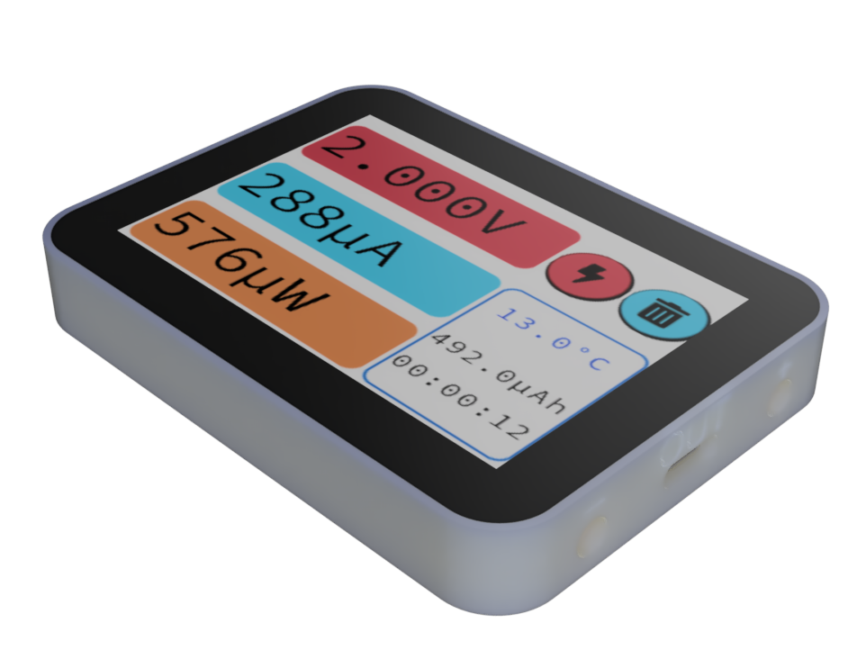
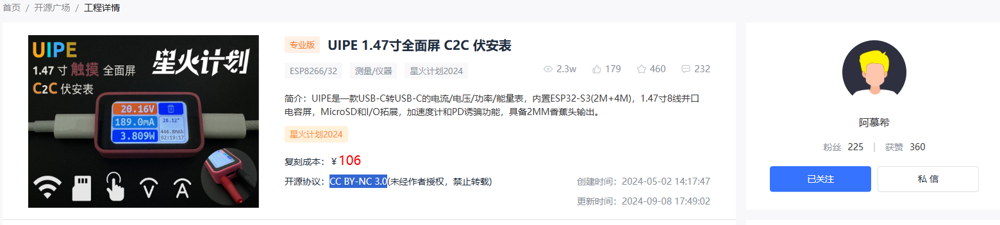
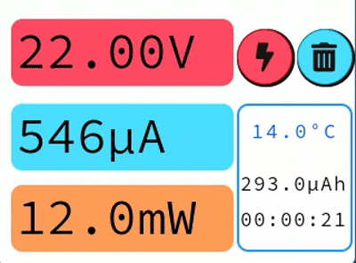

<p align="center">
  
</p>
  <h1 align="center">
  UIPE2
</h1>

# HardWare [UIPE2](https://oshwhub.com/txp666/uipe2)

# FROM [UIPE](https://oshwhub.com/movecall/avpe147-inch-full-screen-c2c-voltammeter)


原项目来自阿慕希 UIPE
原项目对个人 DIY 手工焊接难度较大,故复刻修改设计了一个 2.8 寸屏幕版 简化了硬件，只保留 INA228，本项目包含了 GUI guider-1.8.1 ui 设计工程文件，可直接在模拟器运行。



# 项目相关功能

- 高精度电流检测：具有 0.1mA 级别精度电流检测，适用于对能耗要求的低功耗设备的能量评估。

- 宽广的功率范围：拥有 100W 的功率量程，能够满足各种设备的不同供电需求。
- PD 诱骗功能：支持 PD 诱骗，可提供 3.3V 至 20V 的可调输出。
- 多路输出：不仅有 USB-C，还并配备 2mm 香蕉输出接口，适用于多种设备的供电。
- HMI 触摸交互：拥有直观的人机交互界面，通过触摸操作实现对设备的控制和调节。
- 无线功能：可作为智能家居控制器，例如与 Home Assistant 等智能家居平台进行连接和控制。
- 小体积：外观设计协调，体积小巧，便于携带和放置。

# 项目参数

|   **Component**   |                                                                                                                                                                                                                                                                                                                              **Specification**                                                                                                                                                                                                                                                                                                                               |
| :---------------: | :--------------------------------------------------------------------------------------------------------------------------------------------------------------------------------------------------------------------------------------------------------------------------------------------------------------------------------------------------------------------------------------------------------------------------------------------------------------------------------------------------------------------------------------------------------------------------------------------------------------------------------------------------------------------------: |
|      主芯片       |                                                                                                                                                                                                                                                                                                                              ESP32-S3-WROOM-1U                                                                                                                                                                                                                                                                                                                               |
|      显示屏       | [2.8TFT 液晶显示屏 240\*320](https://item.taobao.com/item.htm?_u=j20q7cgb73ab&id=763448985967&pisk=gyc0_s_3gxyf1RAHGgNXd4vJDyJRhSNs_cCTX5EwUurW5tBvlRzZScctHVrTscmijoewcShiq2g9lfLbgC4Zv0VtkoEtqFmx51KXCSCNjmgecqE9lfqaqmogCEZTblmt7xLJ9B3jl5NabHdp9fVyKPmc0ry27zz35UU2PxRZL5NwvhXR_-O31DN3ORWNUzr7SPWV_cPzUrUT_PyVgUqzSy6N0coZzU4aurz4uRzzUyza_iza0zzzlrjN3tzN4U4_4tSZb58uabAP_kcZNb-oYtVBh8MEZr20Y4vC_1AzuMEnuC1G_bDuAk5Lq15ZZr0-Y-RctdEEdoeLY0RRi50zSmE-YB5uaJDIWPmDisPxUYGbMbKhX-mg0RhuEiW4-Sq0Ljyy9U37QYcuMj-1d43u0JV-eLtYBSmmdkw2F3iironZi8SD2lHKyjyoY3CofRDIWPmDisoF4-6PLL7f1z8taO6_3zauv_gYwyFuKXmHrUXBh-z7kHLkrO6_3zavvUYldiw4PrKd.&spm=a1z09.2.0.0.1ecc2e8dNJ8mPG) |
|       声音        |                                                                                                                                                                                                                                                                                                                              4020 封装的蜂鸣器                                                                                                                                                                                                                                                                                                                               |
|  数字功率监控器   |                                                                                                                                                                                                                                                                                                                                 INA228AIDGST                                                                                                                                                                                                                                                                                                                                 |
| USB Type-C 控制器 |                                                                                                                                                                                                                                                                                                                                 FUSB302BUCX                                                                                                                                                                                                                                                                                                                                  |
|     输入接口      |                                                                                                                                                                                                                                                                                                                           USB-C（5A 座子，橙色芯）                                                                                                                                                                                                                                                                                                                           |
|     输出接口      |                                                                                                                                                                                                                                                                                                               USB-C（5A 座子，橙色芯），M2 香蕉座独立控制输出                                                                                                                                                                                                                                                                                                                |
|     输入电源      |                                                                                                                                                                                                                                                                                                                                  DC 5V~20V                                                                                                                                                                                                                                                                                                                                   |

# VER:

```
V1.2
2025-1-23 txp
1.添加CPU 内存信息页面
2.添加CPU 内存发送py脚本toESP.py
```

```
V1.1
2025-1-22 txp
1.添加MQTT设置
2.添加智能设备UI界面，通过自定义MQTT消息连接到HomeAssistant
```

```
V1.0
2025-1-19 txp
first commit
```
